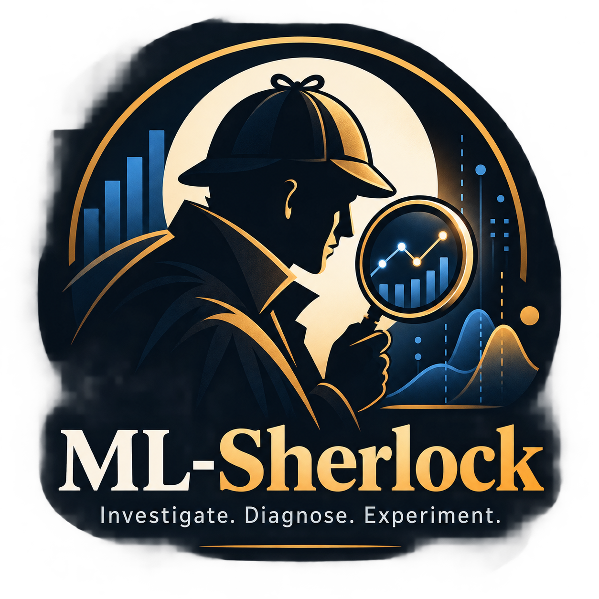

<div align="center">



# ML-Sherlock 🕵️

### Investigate. Diagnose. Experiment.

**An open-source investigation engine for machine learning models in production.**

When a model degrades, ML-Sherlock investigates **what changed, where the model is failing, which evidence supports the diagnosis, and which experiment should be run next.**

[](#)
[](LICENSE)
[](#)
[](#)

</div>

---

## Why ML-Sherlock?

Traditional ML monitoring tools are good at telling you that something changed:

```text
RMSE increased by 47%.

Feature X drifted.

PSI = 0.31.

p < 0.01.
```

But that leaves the most important question unanswered:

> **Why did the model get worse?**

A drifting feature does not necessarily explain a performance drop. A global metric can hide a severe failure in one customer segment. And automatically retraining whenever drift is detected may solve nothing.

ML-Sherlock approaches production model degradation as an **investigation problem**.

Instead of stopping at detection:

```text
Performance Degradation
        ↓
What changed?
        ↓
Where is the model failing?
        ↓
What evidence supports the diagnosis?
        ↓
What hypotheses can explain it?
        ↓
Which experiment can test them?
        ↓
Did the experiment actually improve the model?
```

The goal is not simply to monitor your model.

The goal is to **investigate its failure**.

---

# How It Works

ML-Sherlock follows an evidence-driven investigation loop:

```text
                 Production Model
                        │
                        ▼
              Performance Analysis
                        │
          ┌─────────────┴─────────────┐
          │                           │
          ▼                           ▼
   Distribution Drift           Error Analysis
          │                           │
    ┌─────┼─────┐              ┌──────┼──────┐
    │     │     │              │             │
 Feature Target Prediction  Residuals   Feature ↔ Error
 Drift   Drift    Drift          │             │
    │                            │             │
    └──────────────┬─────────────┴──────┬──────┘
                   │                    │
                   ▼                    ▼
              Segment Analysis     Error Model
                   │                    │
                   └──────────┬─────────┘
                              ▼
                       Evidence Store
                              │
                              ▼
                       Evidence Ranker
                              │
                              ▼
                       Diagnosis Engine
                              │
                              ▼
                       Hypothesis Engine
                              │
                              ▼
                       Research Planner
                              │
                              ▼
                    Controlled Experiment
                              │
                              ▼
                           Validate
                              │
                   ┌──────────┴──────────┐
                   ▼                     ▼
                 MLflow              HTML Report
```

---

# From Monitoring to Investigation

Consider a production model whose RMSE suddenly increases.

A traditional monitoring workflow may produce:

```text
RMSE increased 59.7%.

purchase_frequency drift detected.

PSI = 0.31.
```

Useful — but incomplete.

ML-Sherlock attempts to build a deeper evidence chain:

```text
🔎 ML-Sherlock Investigation

Performance
────────────────────────────────────
RMSE             12.4 → 19.8
Degradation            +59.7%


Top Evidence
────────────────────────────────────
EV-001  Feature Drift

purchase_frequency
PSI                    0.31
Severity               HIGH


EV-002  Feature ↔ Error

purchase_frequency
Spearman               0.48
Severity               HIGH


EV-003  Segment Degradation

customer_type=C
RMSE             13.1 → 28.7
Degradation           +119%


Diagnosis
────────────────────────────────────
Performance degradation is concentrated
in customer_type=C and is associated with
a shift in purchase_frequency.


Hypothesis H-001
────────────────────────────────────
Recent behavior in customer_type=C may
no longer be represented by the reference
training distribution.


Experiment
────────────────────────────────────
Retrain using recent Segment C observations.


Validation
────────────────────────────────────
RMSE             19.8 → 16.1

Experiment result: VALIDATED
```

ML-Sherlock deliberately uses language such as **associated with**, rather than claiming that observational drift proves causality.

---

# Core Capabilities

## 🔍 Detect

Identify meaningful changes between reference and production data.

ML-Sherlock analyzes:

- feature drift
- target drift
- prediction drift
- residual drift
- missingness changes
- categorical changes
- new category rates

Numeric drift analysis includes:

- Kolmogorov-Smirnov test
- Population Stability Index (PSI)
- Wasserstein distance
- mean / median / standard deviation shifts

Categorical analysis includes:

- Chi-square
- PSI
- cardinality changes
- unseen categories
- missingness changes

Statistical significance alone is not treated as sufficient evidence of meaningful drift.

---

## 📊 Control False Discoveries

Testing dozens or hundreds of features independently can generate false-positive drift alerts.

ML-Sherlock supports **Benjamini-Hochberg False Discovery Rate correction** across feature-level statistical tests.

Both values remain available:

```text
raw p-value
adjusted p-value
```

Multiple-testing correction can also be disabled when explicitly required.

---

## 🧭 Diagnose

Detection tells you that something changed.

Diagnosis asks whether those changes are related to the observed model failure.

ML-Sherlock combines multiple evidence sources rather than relying on a single drift test.

The Diagnosis Engine can reason over patterns involving:

```text
Performance degradation
+
Feature drift
+
Target / prediction drift
+
Residual changes
+
Feature-error relationships
+
Segment degradation
```

Diagnosis remains deterministic and does not require an LLM.

---

## 📉 Analyze Model Residuals

Sometimes the most useful signal is not:

```text
P(X)
```

but:

```text
y - ŷ
```

ML-Sherlock analyzes production residuals and absolute error distributions to determine how the model's error behavior changed.

This includes:

- residual distribution comparison
- absolute-error analysis
- error quantiles
- residual drift
- reference vs production error behavior

---

## 🔗 Find Features Associated With Error

A feature can drift without hurting the model.

ML-Sherlock therefore also investigates:

> **Which features are associated with increased prediction error?**

For numeric features, the investigation can use signals such as:

- Spearman association with absolute error
- binned error behavior
- statistical relationships

For categorical features:

- group MAE
- group RMSE
- error lift
- category-level failure patterns

This allows the system to distinguish:

```text
"This feature drifted."
```

from the much more useful:

```text
"This feature drifted AND model error is strongly associated with it."
```

---

## 👥 Discover Failing Segments

Global metrics can hide severe local failures.

For example:

```text
Overall RMSE       15.0

Customer A         11.2
Customer B         13.4
Customer C         29.1
```

ML-Sherlock can analyze categorical and numeric segments to identify where degradation is concentrated.

Segment evidence includes:

- reference performance
- production performance
- degradation percentage
- error lift
- sample size

Tiny or statistically unreliable segments can be filtered using configurable minimum sample sizes.

---

## 🧠 Learn Where the Model Fails

ML-Sherlock can train a secondary diagnostic model:

```text
Production Features
        │
        ▼
    Error Model
        │
        ▼
     |y - ŷ|
```

The Error Model does **not** replace the production model.

Its purpose is different:

> Predict where the primary model is likely to make large errors.

This provides another source of evidence about the conditions associated with model failure.

---

# Evidence First

Evidence is a first-class concept in ML-Sherlock.

Every important finding can be represented as structured evidence:

```python
Evidence(
    id="EV-001",
    type="feature_drift",
    feature="purchase_frequency",
    metric="psi",
    value=0.31,
    threshold=0.20,
    severity="high",
)
```

Evidence can represent:

```text
performance_degradation
feature_drift
target_drift
prediction_drift
residual_drift
feature_error_relationship
segment_degradation
```

The investigation pipeline then becomes:

```text
Measurements
     ↓
 Evidence
     ↓
 Diagnosis
     ↓
Hypothesis
     ↓
Experiment
```

This design keeps statistical computation separate from reasoning.

---

# Evidence-Based Hypotheses

Hypotheses are not free-form explanations.

They must be traceable back to measured evidence.

Conceptually:

```python
Hypothesis(
    id="H-001",
    type="segment_specific_degradation",
    claim="Performance degradation is concentrated in customer_type=C.",
    evidence_ids=[
        "EV-003",
        "EV-007",
        "EV-011",
    ],
    testable=True,
    recommended_experiment="segment_retraining",
)
```

This creates an auditable chain:

```text
Evidence
   ↓
Diagnosis
   ↓
Hypothesis
   ↓
Experiment
   ↓
Result
```

---

# Controlled Experiments

ML-Sherlock does not automatically accept a hypothesis just because it sounds plausible.

It attempts to test hypotheses through bounded experiments.

Currently supported experiment actions include:

```text
retrain_recent_data
drop_drifted_features
model_search
segment_retraining
recent_window_retraining
feature_subset_search
```

Every action must be explicitly registered in `allowed_actions`.

Neither deterministic planning nor an LLM can execute arbitrary code or invent new experiment actions.

Experiments record:

- hypothesis ID
- supporting evidence IDs
- action
- training rows
- features used
- model family
- holdout metrics
- improvement
- accepted / rejected status
- random seed

---

# Validation Strategy

ML-Sherlock deliberately separates experiment selection from final evaluation.

Production data is split into:

```text
Production Data
      │
      ├──────────────► Independent Final Evaluation
      │
      ▼
Development Production Data
      │
      ├── Adaptation Data
      │
      └── Selection Holdout
```

Candidate experiments are compared on a fixed selection holdout.

After the investigation finishes, the selected candidate is evaluated once against the reserved final evaluation set.

This helps avoid repeatedly optimizing against the final evaluation data.

The resulting deployment status is explicitly recorded:

```text
review_candidate
```

or:

```text
keep_baseline
```

ML-Sherlock does **not** automatically deploy models.

---

# Model Candidates

Regression currently supports:

- Random Forest
- Extra Trees
- XGBoost
- LightGBM

All candidates use reproducible preprocessing pipelines and configurable model-selection metrics.

Supported metrics include:

```text
RMSE
MAE
MAPE
R²
```

---

# Optional LLM Planning

ML-Sherlock works completely without an LLM.

This is intentional.

```text
Statistics
    ↓
Evidence
    ↓
Diagnosis
    ↓
Hypotheses
```

are deterministic.

An optional LLM can then operate on the structured investigation state:

```text
Ranked Evidence
      ↓
Diagnosis
      ↓
Hypotheses
      ↓
LLM Planner
      ↓
Allowed Experiment
```

The LLM does **not**:

- calculate drift metrics
- calculate model performance
- invent evidence
- execute arbitrary code
- create unregistered actions

Returned evidence IDs and actions are validated before execution.

If LLM planning fails, ML-Sherlock falls back to deterministic planning.

Supported providers currently include:

- Ollama
- OpenAI
- OpenAI-compatible endpoints

This keeps ML-Sherlock **local-first and provider-agnostic**.

---

# MLflow Tracking

ML-Sherlock uses MLflow as the investigation system of record.

The lineage is approximately:

```text
Dataset
   ↓
Baseline Run
   ↓
Evidence
   ↓
Diagnosis
   ↓
Hypotheses
   ↓
Research Iteration 1
   ↓
Research Iteration 2
   ↓
...
   ↓
Final Decision
```

Investigation artifacts include:

```text
research/evidence.json
research/diagnosis.json
research/hypotheses.json
research/lineage.json
```

Experiment runs record candidate and recommended metrics separately so rejected experiments remain auditable.

The final investigation produces:

- HTML report
- fitted model artifact
- decision JSON
- investigation data
- MLflow runs and artifacts

---

# Installation

Clone the repository:

```bash
git clone https://github.com/serkanars/ml-sherlock.git
cd ml-sherlock
```

Install:

```bash
pip install -e .
```

Optional OpenAI-compatible support:

```bash
pip install -e ".[openai]"
```

---

# Quick Start

Copy the example configuration:

```bash
cp sherlock.example.yaml sherlock.yaml
```

Configure your datasets:

```yaml
version: 1

data:
  target: customer_value
  train: train.csv
  production: production.csv

models:
  candidates:
    - random_forest
    - extra_trees
    - xgboost
    - lightgbm

  selection_metric: rmse
  random_state: 42

investigation:

  drift:
    enabled: true
    alpha: 0.05
    multiple_testing: benjamini_hochberg

  error_analysis:
    enabled: true
    metrics:
      - rmse
      - mae
      - mape
      - r2

  segments:
    enabled: true
    columns:
      - customer_type
    min_rows: 100
    numeric_bins: 4
    max_segments: 20

experiments:

  max_iterations: 5
  adaptation_fraction: 0.5
  min_improvement_pct: 1.0

  allowed_actions:
    - retrain_recent_data
    - drop_drifted_features
    - model_search
    - segment_retraining
    - recent_window_retraining
    - feature_subset_search

llm:
  enabled: false

report:
  output: artifacts/report.html
```

Run:

```bash
ml-sherlock run --config sherlock.yaml
```

Or from Python:

```python
from ml_sherlock import Sherlock

sherlock = Sherlock(config="sherlock.yaml")

result = sherlock.investigate()

print(result["investigation"]["report"])
```

---

# Configuration

ML-Sherlock uses a strict, versioned Pydantic configuration model:

```text
SherlockConfig
│
├── DataConfig
├── TrackingConfig
├── ModelConfig
│
├── InvestigationConfig
│   ├── DriftConfig
│   ├── ErrorAnalysisConfig
│   └── SegmentConfig
│
├── ExperimentConfig
├── LLMConfig
└── ReportConfig
```

Invalid configuration is rejected before model training starts.

This includes:

- unknown configuration keys
- unsupported models
- unsupported metrics
- unsupported experiment actions
- invalid thresholds
- invalid segment settings
- incomplete LLM configuration

The typed configuration can also be used programmatically:

```python
from ml_sherlock import SherlockConfig

config = SherlockConfig.from_yaml("sherlock.yaml")

schema = SherlockConfig.model_json_schema()
```

---

# Examples

Reproducible examples are available under `examples/`.

Current examples include:

- California Housing
- NYC Taxi
- Citi Bike
- Seoul Bike Sharing

Each example contains:

```text
prepare.py
sherlock.yaml
README.md
```

and creates a reproducible reference / production investigation scenario.

---

# Project Structure

```text
ml-sherlock/
│
├── src/ml_sherlock/
│   │
│   ├── core/
│   │
│   ├── data/
│   │
│   ├── evidence/
│   │   ├── models.py
│   │   ├── ranking.py
│   │   └── store.py
│   │
│   ├── investigation/
│   │   ├── diagnosis.py
│   │   ├── engine.py
│   │   ├── error_models.py
│   │   ├── experiments.py
│   │   ├── feature_errors.py
│   │   ├── hypotheses.py
│   │   ├── loop.py
│   │   ├── residuals.py
│   │   └── segments.py
│   │
│   ├── llm/
│   ├── models/
│   ├── monitoring/
│   ├── reporting/
│   │
│   ├── config.py
│   ├── sherlock.py
│   └── cli.py
│
├── examples/
├── tests/
├── sherlock.example.yaml
└── pyproject.toml
```

---

# Design Principles

ML-Sherlock follows a few important principles.

### Evidence before explanation

Statistical measurements are computed before reasoning begins.

### Association is not causation

Observed drift and error relationships are treated as evidence, not proof of root cause.

### LLMs reason — they don't measure

LLMs never replace deterministic statistical analysis.

### Experiments validate hypotheses

A plausible explanation is not considered validated until it survives an experiment.

### Local first

The core investigation engine requires no cloud service or LLM.

### Reproducibility

Datasets, models, evidence, hypotheses, experiments and decisions are tracked so an investigation can be reconstructed.

### Bounded autonomy

Automated investigation operates only through explicitly registered experiment actions.

---

# What ML-Sherlock Is — and Isn't

ML-Sherlock is **not another AutoML framework**.

Its primary question is not:

> Which model gives me the highest validation score?

It is also **not just another drift detector**.

Its primary question is not:

> Which features changed distribution?

ML-Sherlock focuses on a different problem:

> **My production model got worse. What happened, what evidence supports the explanation, and what should I test next?**

---

# Current Scope

ML-Sherlock currently focuses primarily on **supervised regression investigations with labelled production data**.

The project is under active development.

Areas that may evolve include:

- classification support
- delayed-label investigations
- richer temporal analysis
- additional experiment strategies
- model-agnostic explainability
- investigation memory
- multi-window production analysis
- richer provider integrations

---

# Roadmap

The long-term direction is an autonomous but evidence-constrained ML investigation loop:

```text
Detect
   ↓
Diagnose
   ↓
Collect Evidence
   ↓
Hypothesize
   ↓
Experiment
   ↓
Validate
   ↓
Learn
   ↺
```

The goal is not autonomous model deployment.

The goal is **autonomous investigation with human-reviewable evidence**.

---

# Contributing

ML-Sherlock is still evolving and contributions are welcome.

Useful contribution areas include:

- statistical investigation methods
- model failure diagnostics
- drift detection
- experiment strategies
- additional model families
- classification support
- tests and synthetic failure scenarios
- documentation and examples

When contributing investigation logic, please preserve the core principle:

> **Evidence should be measurable, reproducible, and separate from interpretation.**

---

# License

ML-Sherlock is released under the [GNU General Public License v3.0](LICENSE).

---

<div align="center">

### ML-Sherlock 🕵️

**Investigate. Diagnose. Experiment.**

*Because detecting model degradation is only the beginning.*

</div>