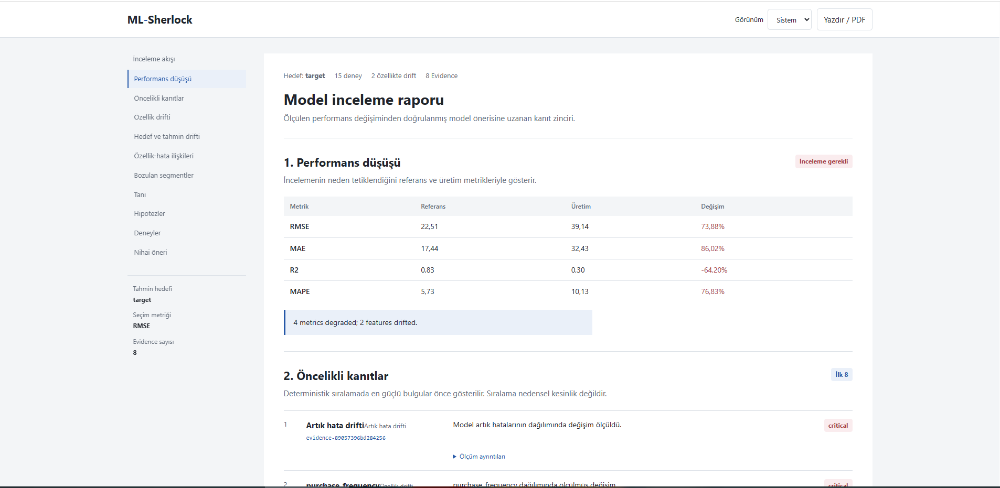

<p align="center">
  
</p>

<h1 align="center">ML-Sherlock 🕵️</h1>

<p align="center"><b>An open-source investigation engine for production ML models.</b><br>
Investigate. Diagnose. Experiment.</p>

<p align="center">
  
  
  
  
</p>

---

When a production model degrades, monitoring tools tell you *that* something changed: "RMSE +47%, PSI = 0.31". ML-Sherlock goes further and asks:

> **What changed, where is the model failing, what evidence supports the diagnosis, and what should I test next?**

It is not an AutoML framework and not just a drift detector. It treats model degradation as an **investigation problem**.

## Example

```
🔎 ML-Sherlock Investigation

Performance   RMSE 12.4 → 19.8  (+59.7%)

Evidence
  EV-001  Feature drift        purchase_frequency   PSI 0.31        HIGH
  EV-002  Feature ↔ error      purchase_frequency   Spearman 0.48   HIGH
  EV-003  Segment degradation  customer_type=C      RMSE 13.1 → 28.7 (+119%)

Diagnosis
  Degradation is concentrated in customer_type=C and is associated
  with a shift in purchase_frequency.

Hypothesis H-001
  Recent behavior in customer_type=C is no longer represented
  in the training distribution.

Experiment  Retrain on recent Segment C data
Result      RMSE 19.8 → 16.1   VALIDATED
```

> Note the wording: *associated with*. Drift and error relationships are treated as evidence, not proof of causality.

<p align="center">
  
</p>
<p align="center"><i>A real investigation report generated from the example datasets .</i></p>

## Quick Start

```bash
git clone https://github.com/serkanars/ml-sherlock.git
cd ml-sherlock
pip install -e .
# optional: OpenAI-compatible LLM planning
pip install -e ".[openai]"
```

Create a config:

```bash
cp sherlock.example.yaml sherlock.yaml
```

```yaml
version: 1

data:
  target: customer_value
  train: train.csv
  production: production.csv

models:
  candidates: [random_forest, extra_trees, xgboost, lightgbm]
  selection_metric: rmse

investigation:
  segments:
    columns: [customer_type]

llm:
  enabled: false

report:
  output: artifacts/report.html
```

Run:

```bash
ml-sherlock run --config sherlock.yaml
```

Or from Python:

```python
from ml_sherlock import Sherlock

result = Sherlock(config="sherlock.yaml").investigate()
print(result["investigation"]["report"])
```

The full set of options is in [`sherlock.example.yaml`](sherlock.example.yaml).

## How It Works

```
Measurements → Evidence → Diagnosis → Hypotheses → Experiments → Validation
                                                                     │
                                                      MLflow + HTML report
```

1. **Detect**: feature, target, prediction and residual drift (KS, PSI, Wasserstein, Chi-square, missingness, unseen categories). Benjamini-Hochberg FDR correction is supported; raw and adjusted p-values are both kept.
2. **Analyze errors**: residual distributions, features associated with error, and an optional secondary *error model* that predicts where the model is likely to fail.
3. **Find failing segments**: categorical and numeric segments with reference vs. production metrics, error lift and minimum sample sizes.
4. **Diagnose**: a deterministic engine combines evidence into a diagnosis. No LLM required.
5. **Hypothesize**: every hypothesis links back to measured evidence IDs.
6. **Experiment**: bounded experiments test the hypotheses, e.g. `retrain_recent_data`, `drop_drifted_features`, `model_search`, `segment_retraining`, `recent_window_retraining`, `feature_subset_search`.
7. **Validate**: candidates are compared on a selection holdout, then the winner is evaluated **once** on a reserved final set. The outcome is `review_candidate` or `keep_baseline`. Models are never deployed automatically.

## Design Principles

- **Evidence before explanation**: statistics are computed first, interpretation comes after.
- **Association is not causation**.
- **LLMs reason, they don't measure**: the optional LLM planner (Ollama, OpenAI, OpenAI-compatible) only picks from registered actions, and falls back to deterministic planning on failure.
- **Bounded autonomy**: only actions listed in `allowed_actions` can run.
- **Local first and reproducible**: no cloud or LLM needed; datasets, evidence, hypotheses, experiments and decisions are tracked in MLflow.

## Outputs

HTML report, fitted model artifact, decision JSON, and MLflow runs with `evidence.json`, `diagnosis.json`, `hypotheses.json` and `lineage.json`.

## Examples

Reproducible scenarios live in [`examples/`](examples): California Housing, NYC Taxi, Citi Bike, Seoul Bike Sharing. Each has `prepare.py`, `sherlock.yaml` and its own README.

## Scope & Roadmap

Currently focused on **supervised regression with labelled production data**. Planned: classification, delayed labels, richer temporal analysis, more experiment strategies, explainability, investigation memory.

The goal is not autonomous deployment. It is **autonomous investigation with human-reviewable evidence**.

## Contributing

Contributions are welcome, especially statistical methods, failure diagnostics, drift detection, experiment strategies, new model families, classification support, tests and examples.

Please preserve the core principle: **evidence should be measurable, reproducible, and separate from interpretation.**

## License

[GNU General Public License v3.0](LICENSE)